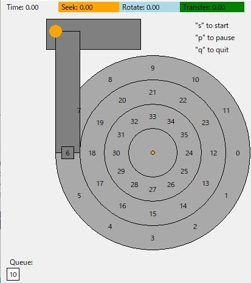

# Homework

This homework uses `disk.py` to familiarize you with how a modern
hard drive works. It has a lot of different options, and unlike most of
the other simulations, has a graphical animator to show you exactly what
happens when the disk is in action. See the README for details.




###### How to calculate.

To calculate this (instead of just running the simulation), you would need to
know a few details about the disk. 

- First, the rotational speed is by default set to 1 degree per time unit. Thus, to make a complete revolution, it takes 360 time units. 
- Second, transfer begins and ends at the halfway point between
  sectors. Thus, to read sector 10, the transfer begins halfway between 9 and 10,
  and ends halfway between 10 and 11.  
- Finally, in the default disk, there are **12 sectors per track**, meaning that each sector takes up 30 degrees of the rotational space. Thus, to read a sector, it takes 30 time units (given our
  default speed of rotation).

The distance between each track is by default 40 distance units, and the
default rate of seeking is 1 distance unit per unit time. Thus, a seek from
the outer track to the middle track takes 40 time units.

## Question

1, Compute the seek, rotation, and transfer times for the following
sets of requests: -a 0, -a 6, -a 30, -a 7,30,8, and finally -a
10,11,12,13.

| -a          | Seek time | Rotation time | Transfer time |
| ----------- | --------- | ------------- | ------------- |
| 0           | 0         | 165           | 30            |
| 6           | 0         | 345           | 30            |
| 30          | 80        | 265           | 30            |
| 7,30,8      | 160       | 545           | 90            |
| 10,11,12,13 | 40        | 425           | 120           |

> (7,30,8)
> 7: (s,r,t) = 0,15,30
> 30: 80,220,30
> 8:  80,310,30
>
> (10,11,12,13)
> 10,11: 0,105,60
> 12,13: 40,305,60

2, Do the same requests above, but change the seek rate to different
values: -S 2, -S 4, -S 8, -S 10, -S 40, -S 0.1. How do the
times change?

| -a \ -S     | 2    | 4    | 8    | 10   | 40   | 0.1  |
| ----------- | ---- | ---- | ---- | ---- | ---- | ---- |
| 0           | 195  | 195  | 195  | 195  | 195  | 195  |
| 6           | 375  | 375  | 375  | 375  | 375  | 375  |
| 30          | 375  | 375  | 375  | 375  | 375  | 1095 |
| 7,30,8      | 795  | 435  | 435  | 435  | 435  | 2235 |
| 10,11,12,13 | 585  | 585  | 585  | 585  | 585  | 945  |

3, Do the same requests above, but change the rotation rate: -R 0.1,
-R 0.5, -R 0.01. How do the times change? (-a 7,30,8)

| -R \ -S | 2     | 4     | 8     | 10    | 40    | 0.1   |
| ------- | ----- | ----- | ----- | ----- | ----- | ----- |
| 0.1     | 4349  | 4349  | 4349  | 4349  | 4349  | 7949  |
| 0.5     | 870   | 870   | 870   | 870   | 870   | 3030  |
| 0.01    | 43500 | 43500 | 43500 | 43500 | 43500 | 43500 |

> As for the rotation rate; faster, better.

4, You might have noticed that some request streams would be better
served with a policy better than FIFO. For example, with the
request stream -a 7,30,8, what order should the requests be processed
in? Now run the shortest seek-time first (SSTF) scheduler
(-p SSTF) on the same workload; how long should it take (seek,
rotation, transfer) for each request to be served?

```
(-p FIFO)
Block:   7  Seek:  0  Rotate: 15  Transfer: 30  Total:  45
Block:  30  Seek: 80  Rotate:220  Transfer: 30  Total: 330
Block:   8  Seek: 80  Rotate:310  Transfer: 30  Total: 420

TOTALS      Seek:160  Rotate:545  Transfer: 90  Total: 795

(-p SSTF)
Block:   7  Seek:  0  Rotate: 15  Transfer: 30  Total:  45
Block:   8  Seek:  0  Rotate:  0  Transfer: 30  Total:  30
Block:  30  Seek: 80  Rotate:190  Transfer: 30  Total: 300

TOTALS      Seek: 80  Rotate:205  Transfer: 90  Total: 375
```


5, Now do the same thing, but using the shortest access-time first
(SATF) scheduler (-p SATF). Does it make any difference for the
set of requests as specified by -a 7,30,8? Find a set of requests
where SATF does noticeably better than SSTF; what are the conditions
for a noticeable difference to arise?

```
(-p SATF)
Block:   7  Seek:  0  Rotate: 15  Transfer: 30  Total:  45
Block:   8  Seek:  0  Rotate:  0  Transfer: 30  Total:  30
Block:  30  Seek: 80  Rotate:190  Transfer: 30  Total: 300

TOTALS      Seek: 80  Rotate:205  Transfer: 90  Total: 375
```

```
(-a 19,34 -p SSTF)
Block:  19  Seek: 40  Rotate:335  Transfer: 30  Total: 405
Block:  34  Seek: 40  Rotate: 20  Transfer: 30  Total:  90

TOTALS      Seek: 80  Rotate:355  Transfer: 60  Total: 495

(-a 19,34 -p SATF)
Block:  34  Seek: 80  Rotate: 25  Transfer: 30  Total: 135
Block:  19  Seek: 40  Rotate:200  Transfer: 30  Total: 270

TOTALS      Seek:120  Rotate:225  Transfer: 60  Total: 405
```

> S1 + R1 > S2 + R2
>
> S1 - S2 > R2 - R1
>
> S2 - S1 (= 40) < R1 - R2 
>
> R1 - 40 > R2

6, You might have noticed that the request stream -a 10,11,12,13
wasn’t particularly well handled by the disk. Why is that? Can you
introduce a track skew to address this problem (-o skew, where
skew is a non-negative integer)? 

```
(-o 0)
Block:  10  Seek:  0  Rotate:105  Transfer: 30  Total: 135
Block:  11  Seek:  0  Rotate:  0  Transfer: 30  Total:  30
Block:  12  Seek: 40  Rotate:320  Transfer: 30  Total: 390
Block:  13  Seek:  0  Rotate:  0  Transfer: 30  Total:  30

TOTALS      Seek: 40  Rotate:425  Transfer:120  Total: 585

(-o 2)
Block:  10  Seek:  0  Rotate:105  Transfer: 30  Total: 135
Block:  11  Seek:  0  Rotate:  0  Transfer: 30  Total:  30
Block:  12  Seek: 40  Rotate: 20  Transfer: 30  Total:  90
Block:  13  Seek:  0  Rotate:  0  Transfer: 30  Total:  30

TOTALS      Seek: 40  Rotate:125  Transfer:120  Total: 285
```


7, Given the default seek rate, what should the skew be to minimize the total time for this set of requests?
What about for different seek rates (e.g., -S 2, -S 4)? In general, could you write a formula to figure out the skew, given the seek rate and sector layout information?

8, Multi-zone disks pack more sectors into the outer tracks. To configure
this disk in such a way, run with the -z flag. Specifically, try
running some requests against a disk run with -z 10,20,30 (the
numbers specify the angular space occupied by a sector, per track;
in this example, the outer track will be packed with a sector every
10 degrees, the middle track every 20 degrees, and the inner track
with a sector every 30 degrees). Run some random requests (e.g.,
-a -1 -A 5,-1,0, which specifies that random requests should
be used via the -a -1 flag and that five requests ranging from 0 to
the max be generated), and see if you can compute the seek, rotation,
and transfer times. Use different random seeds (-s 1, -s 2,
etc.). What is the bandwidth (in sectors per unit time) on the outer,
middle, and inner tracks?

9, Scheduling windows determine how many sector requests a disk
can examine at once in order to determine which sector to serve
next. Generate some random workloads of a lot of requests (e.g.,
-A 1000,-1,0, with different seeds perhaps) and see how long
the SATF scheduler takes when the scheduling window is changed
from 1 up to the number of requests (e.g., -w 1 up to -w 1000,
and some values in between). How big of scheduling window is
needed to approach the best possible performance? Make a graph
and see. Hint: use the -c flag and don’t turn on graphics with -G
to run these more quickly. When the scheduling window is set to 1,
does it matter which policy you are using?

10, Avoiding starvation is important in a scheduler. Can you think of a
series of requests such that a particular sector is delayed for a very
long time given a policy such as SATF? Given that sequence, how
does it perform if you use a bounded SATF or BSATF scheduling
approach? In this approach, you specify the scheduling window
(e.g., -w 4) as well as the BSATF policy (-p BSATF); the scheduler
then will only move onto the next window of requests when all of
the requests in the current window have been serviced. Does this
solve the starvation problem? How does it perform, as compared
to SATF? In general, how should a diskmake this trade-off between
performance and starvation avoidance?

11, All the scheduling policies we have looked at thus far are greedy,
in that they simply pick the next best option instead of looking for
the optimal schedule over a set of requests. Can you find a set of
requests in which this greedy approach is not optimal?